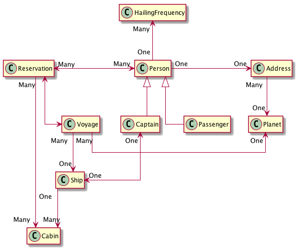

Learn JPA Hibernate
===================

## TL;DR Entity Bean Relationships HOW-TO

Look for your desired type of relationship from the picture below and copy the
configuration from those classes. There are seven different types of relationships 
to consider. Some are used multiple of times in this design. Verify your configuration
with a test case.

An example of a `@DiscriminatorColumn` is used in `Captain` and `Person`.

An example of `@PrePersist` is used in `HailingFrequency`.

This project also shows an example (Money) as a custom user type. In the `Cabin` entity 
bean, the `price` property is designed as a `MonetaryAmount`. The value of this property
is saved in the database as two columns and is rendered as JSON in a custom format. 
To make this happen, you need:

1. The `MonetaryAmountUserType` class helps Hibernate to marshal the value to and from 
   the database
2. The `MonetaryAmountSerializer` and `MonetaryAmountDeserializer` classes are used 
   by Jackson to render the value to and from JSON
3. The `MonetaryAmountJsonSerialize` is a convenience annotation used to annotate your
   properties
4. Verify that a test case uses the classes in a controller test